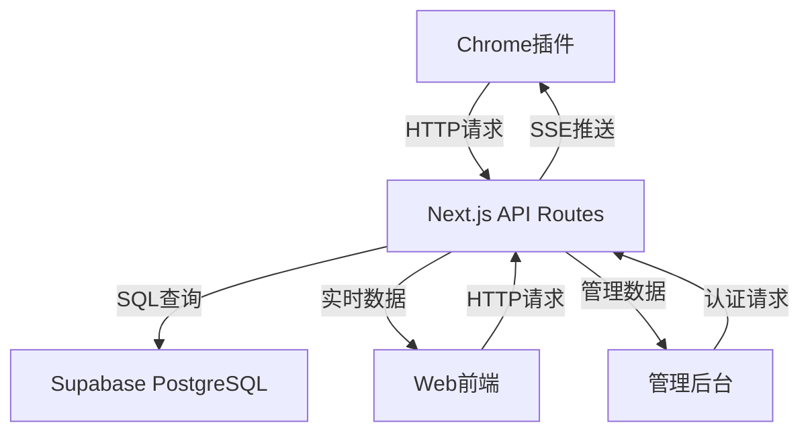

# LinkedIn数据提取系统 - 技术实现指南

详细的技术实现方案和代码示例，基于CLAUDE-REDESIGN.md架构设计

---

## 🏗️ **系统架构详解**

### 核心通信架构


### 数据流程设计
1. **用户提交搜索** → API验证 → 任务入队
2. **插件心跳检查** → 任务分配 → SSE推送  
3. **插件数据提取** → 结果提交 → 状态更新
4. **用户获取结果** → 数据展示 → Excel导出

---

## 🔧 **API路由实现**

### 1. 兑换码验证API

```typescript
// src/app/api/redemption-codes/validate/route.ts
import { NextRequest, NextResponse } from 'next/server'
import { createServerSupabase } from '@/lib/supabase'
import { createApiResponse } from '@/lib/utils'

export async function POST(request: NextRequest) {
  try {
    const { code } = await request.json()
    
    if (!code || typeof code !== 'string') {
      return NextResponse.json(
        createApiResponse(false, null, null, '兑换码不能为空'),
        { status: 400 }
      )
    }

    const supabase = createServerSupabase()
    
    // 调用数据库函数验证兑换码
    const { data, error } = await supabase.rpc('validate_redemption_code', {
      p_code: code
    })

    if (error) {
      console.error('验证兑换码错误:', error)
      return NextResponse.json(
        createApiResponse(false, null, null, '验证失败'),
        { status: 500 }
      )
    }

    const result = data[0]
    
    return NextResponse.json(
      createApiResponse(true, {
        isValid: result.is_valid,
        codeId: result.code_id,
        remainingUses: result.remaining_uses,
        dailyRemaining: result.daily_remaining,
        singleLimit: result.single_limit,
        message: result.message
      })
    )

  } catch (error) {
    console.error('API错误:', error)
    return NextResponse.json(
      createApiResponse(false, null, null, '服务器内部错误'),
      { status: 500 }
    )
  }
}
```

### 2. 任务创建API

```typescript
// src/app/api/tasks/create/route.ts
import { NextRequest, NextResponse } from 'next/server'
import { createServerSupabase } from '@/lib/supabase'
import { createApiResponse } from '@/lib/utils'

export async function POST(request: NextRequest) {
  try {
    const { code, taskType, searchParams, maxResults = 500 } = await request.json()
    
    // 参数验证
    if (!code || !taskType || !searchParams) {
      return NextResponse.json(
        createApiResponse(false, null, null, '缺少必需参数'),
        { status: 400 }
      )
    }

    const supabase = createServerSupabase()
    
    // 调用创建任务函数
    const { data, error } = await supabase.rpc('create_search_task', {
      p_code: code,
      p_task_type: taskType,
      p_search_params: searchParams,
      p_max_results: maxResults
    })

    if (error) {
      console.error('创建任务错误:', error)
      return NextResponse.json(
        createApiResponse(false, null, null, '创建任务失败'),
        { status: 500 }
      )
    }

    const result = data[0]
    
    if (!result.success) {
      return NextResponse.json(
        createApiResponse(false, null, null, result.message),
        { status: 400 }
      )
    }

    // 记录IP地址
    const clientIP = request.headers.get('x-forwarded-for') || 
                    request.headers.get('x-real-ip') || 
                    'unknown'
    
    await supabase.from('system_logs').insert({
      log_level: 'info',
      log_type: 'api_request',
      task_id: result.task_id,
      user_ip: clientIP,
      message: '创建搜索任务',
      details: { taskType, maxResults, searchParams }
    })

    return NextResponse.json(
      createApiResponse(true, {
        success: true,
        taskId: result.task_id,
        message: result.message
      })
    )

  } catch (error) {
    console.error('API错误:', error)
    return NextResponse.json(
      createApiResponse(false, null, null, '服务器内部错误'),
      { status: 500 }
    )
  }
}
```

### 3. SSE任务分配端点

```typescript
// src/app/api/plugins/tasks/stream/route.ts
import { NextRequest } from 'next/server'
import { createServerSupabase } from '@/lib/supabase'

export async function GET(request: NextRequest) {
  const { searchParams } = new URL(request.url)
  const pluginId = searchParams.get('pluginId')
  
  if (!pluginId) {
    return new Response('Plugin ID required', { status: 400 })
  }

  const encoder = new TextEncoder()
  const supabase = createServerSupabase()
  
  const stream = new ReadableStream({
    start(controller) {
      // 发送初始连接确认
      controller.enqueue(
        encoder.encode(`data: ${JSON.stringify({
          type: 'connected',
          pluginId,
          timestamp: new Date().toISOString()
        })}\n\n`)
      )
      
      // 设置定时检查待分配任务
      const checkTasks = async () => {
        try {
          // 查找待分配的任务
          const { data: pendingTasks, error } = await supabase
            .from('task_queue')
            .select('*')
            .eq('status', 'pending')
            .order('created_at', { ascending: true })
            .limit(1)
          
          if (error) {
            console.error('查询任务错误:', error)
            return
          }
          
          if (pendingTasks && pendingTasks.length > 0) {
            const task = pendingTasks[0]
            
            // 尝试分配任务给当前插件
            const { data: assignResult, error: assignError } = await supabase.rpc(
              'assign_task_to_plugin', 
              { p_task_id: task.id }
            )
            
            if (!assignError && assignResult) {
              // 推送任务给插件
              controller.enqueue(
                encoder.encode(`data: ${JSON.stringify({
                  type: 'task_assigned',
                  taskId: task.id,
                  taskType: task.task_type,
                  searchParams: task.search_params,
                  maxResults: task.max_results,
                  timeout: 600000 // 10分钟超时
                })}\n\n`)
              )
            }
          }
          
        } catch (error) {
          console.error('任务检查错误:', error)
        }
      }
      
      // 每5秒检查一次新任务
      const interval = setInterval(checkTasks, 5000)
      
      // 清理函数
      return () => {
        clearInterval(interval)
      }
    }
  })
  
  return new Response(stream, {
    headers: {
      'Content-Type': 'text/event-stream',
      'Cache-Control': 'no-cache',
      'Connection': 'keep-alive',
      'Access-Control-Allow-Origin': '*',
      'Access-Control-Allow-Methods': 'GET',
      'Access-Control-Allow-Headers': 'Cache-Control'
    }
  })
}
```

---

## 🔌 **Chrome扩展实现**

### 1. Manifest V3配置

```json
// extension/manifest.json
{
  "manifest_version": 3,
  "name": "LinkedIn数据提取器",
  "version": "1.0.0",
  "description": "专业的LinkedIn数据提取工具",
  
  "permissions": [
    "activeTab",
    "storage",
    "background"
  ],
  
  "host_permissions": [
    "https://www.linkedin.com/*",
    "https://your-api-domain.vercel.app/*"
  ],
  
  "background": {
    "service_worker": "background.js",
    "type": "module"
  },
  
  "content_scripts": [{
    "matches": ["https://www.linkedin.com/*"],
    "js": ["content.js"],
    "run_at": "document_end"
  }],
  
  "action": {
    "default_popup": "popup.html",
    "default_title": "LinkedIn数据提取器"
  },
  
  "icons": {
    "16": "icons/icon16.png",
    "32": "icons/icon32.png",
    "48": "icons/icon48.png",
    "128": "icons/icon128.png"
  }
}
```

### 2. Background Service Worker

```javascript
// extension/background.js
class LinkedInExtractor {
  constructor() {
    this.pluginId = this.generatePluginId()
    this.apiBase = 'https://your-api-domain.vercel.app'
    this.isRegistered = false
    this.currentTask = null
    this.sseConnection = null
    this.heartbeatInterval = null
    
    this.init()
  }
  
  generatePluginId() {
    return 'plugin-' + Date.now() + '-' + Math.random().toString(36).substr(2, 9)
  }
  
  async init() {
    console.log('插件初始化，ID:', this.pluginId)
    await this.registerPlugin()
    this.startHeartbeat()
    this.connectToTaskStream()
  }
  
  async registerPlugin() {
    try {
      const response = await fetch(`${this.apiBase}/api/plugins/register`, {
        method: 'POST',
        headers: {
          'Content-Type': 'application/json'
        },
        body: JSON.stringify({
          pluginId: this.pluginId,
          version: '1.0.0',
          capabilities: ['person-search']
        })
      })
      
      if (response.ok) {
        this.isRegistered = true
        console.log('插件注册成功')
      } else {
        console.error('插件注册失败:', await response.text())
      }
    } catch (error) {
      console.error('插件注册错误:', error)
    }
  }
  
  startHeartbeat() {
    this.heartbeatInterval = setInterval(async () => {
      if (!this.isRegistered) return
      
      try {
        const response = await fetch(`${this.apiBase}/api/plugins/heartbeat`, {
          method: 'POST',
          headers: {
            'Content-Type': 'application/json'
          },
          body: JSON.stringify({
            pluginId: this.pluginId,
            status: this.currentTask ? 'busy' : 'online',
            currentTask: this.currentTask
          })
        })
        
        if (!response.ok) {
          console.error('心跳更新失败:', await response.text())
        }
      } catch (error) {
        console.error('心跳错误:', error)
      }
    }, 30000) // 30秒间隔
  }
  
  connectToTaskStream() {
    if (this.sseConnection) {
      this.sseConnection.close()
    }
    
    this.sseConnection = new EventSource(
      `${this.apiBase}/api/plugins/tasks/stream?pluginId=${this.pluginId}`
    )
    
    this.sseConnection.onopen = () => {
      console.log('SSE连接已建立')
    }
    
    this.sseConnection.onmessage = (event) => {
      try {
        const data = JSON.parse(event.data)
        this.handleSSEMessage(data)
      } catch (error) {
        console.error('解析SSE消息错误:', error)
      }
    }
    
    this.sseConnection.onerror = (error) => {
      console.error('SSE连接错误:', error)
      // 重连逻辑
      setTimeout(() => {
        this.connectToTaskStream()
      }, 5000)
    }
  }
  
  async handleSSEMessage(data) {
    if (data.type === 'task_assigned') {
      console.log('收到新任务:', data.taskId)
      this.currentTask = data.taskId
      await this.processTask(data)
    }
  }
  
  async processTask(taskData) {
    try {
      // 通知content script开始处理任务
      const tabs = await chrome.tabs.query({
        url: ['https://www.linkedin.com/*']
      })
      
      if (tabs.length === 0) {
        throw new Error('没有找到LinkedIn页面')
      }
      
      const tab = tabs[0]
      
      // 发送任务给content script
      const response = await chrome.tabs.sendMessage(tab.id, {
        action: 'START_EXTRACTION',
        taskData: taskData
      })
      
      if (response && response.success) {
        console.log('任务处理完成')
        await this.submitResults(taskData.taskId, response.results)
      } else {
        throw new Error('任务处理失败: ' + (response?.error || '未知错误'))
      }
      
    } catch (error) {
      console.error('处理任务错误:', error)
      await this.submitResults(taskData.taskId, [], 'failed', error.message)
    } finally {
      this.currentTask = null
    }
  }
  
  async submitResults(taskId, results, status = 'completed', error = null) {
    try {
      const response = await fetch(`${this.apiBase}/api/plugins/submit`, {
        method: 'POST',
        headers: {
          'Content-Type': 'application/json'
        },
        body: JSON.stringify({
          taskId: taskId,
          pluginId: this.pluginId,
          results: results || [],
          status: status,
          processedCount: results ? results.length : 0,
          totalCount: results ? results.length : 0,
          error: error
        })
      })
      
      if (response.ok) {
        console.log('结果提交成功')
      } else {
        console.error('结果提交失败:', await response.text())
      }
    } catch (error) {
      console.error('提交结果错误:', error)
    }
  }
}

// 启动插件
const extractor = new LinkedInExtractor()
```

### 3. Content Script数据提取

```javascript
// extension/content.js
class LinkedInDataExtractor {
  constructor() {
    this.isExtracting = false
    this.setupMessageListener()
  }
  
  setupMessageListener() {
    chrome.runtime.onMessage.addListener((request, sender, sendResponse) => {
      if (request.action === 'START_EXTRACTION') {
        this.startExtraction(request.taskData)
          .then(results => {
            sendResponse({ success: true, results })
          })
          .catch(error => {
            sendResponse({ success: false, error: error.message })
          })
        return true // 异步响应
      }
    })
  }
  
  async startExtraction(taskData) {
    if (this.isExtracting) {
      throw new Error('正在提取数据中，请稍后再试')
    }
    
    this.isExtracting = true
    console.log('开始数据提取任务:', taskData.taskId)
    
    try {
      // 根据任务类型执行不同的提取逻辑
      switch (taskData.taskType) {
        case 'person-search':
          return await this.extractPersonProfiles(taskData.searchParams, taskData.maxResults)
        default:
          throw new Error('不支持的任务类型: ' + taskData.taskType)
      }
    } finally {
      this.isExtracting = false
    }
  }
  
  async extractPersonProfiles(searchParams, maxResults) {
    const results = []
    const profileSelectors = {
      name: [
        '.entity-result__title-text a span[aria-hidden="true"]',
        '.search-result__info .search-result__title-text',
        '.entity-result__title-text .entity-result__title-line a'
      ],
      company: [
        '.entity-result__primary-subtitle',
        '.entity-result__secondary-subtitle',
        '.search-result__info .subline-level-1'
      ],
      position: [
        '.entity-result__primary-subtitle',
        '.entity-result__summary',
        '.search-result__info .subline-level-2'
      ],
      location: [
        '.entity-result__secondary-subtitle',
        '.search-result__info .subline-level-2',
        '.entity-result__divider + .entity-result__secondary-subtitle'
      ]
    }
    
    // 等待页面加载完成
    await this.waitForElement('.search-results-container', 10000)
    
    // 获取所有搜索结果
    const resultItems = document.querySelectorAll('.entity-result, .search-result')
    
    for (let i = 0; i < Math.min(resultItems.length, maxResults); i++) {
      const item = resultItems[i]
      
      try {
        const profile = await this.extractSingleProfile(item, profileSelectors)
        if (profile && profile.name) {
          results.push(profile)
        }
      } catch (error) {
        console.warn('提取单个用户资料失败:', error)
      }
      
      // 添加延迟避免被检测
      await this.sleep(Math.random() * 1000 + 500)
    }
    
    // 如果需要更多结果，尝试翻页
    if (results.length < maxResults) {
      await this.tryLoadMoreResults(maxResults - results.length, profileSelectors, results)
    }
    
    console.log(`提取完成，共获得 ${results.length} 条数据`)
    return results
  }
  
  async extractSingleProfile(element, selectors) {
    const profile = {
      name: '',
      company: '',
      position: '',
      experience: '',
      about: '',
      location: '',
      linkedinUrl: '',
      extractedAt: new Date().toISOString(),
      dataQuality: 0
    }
    
    // 提取姓名
    profile.name = this.extractTextBySelectors(element, selectors.name)
    
    // 提取LinkedIn URL
    const profileLink = element.querySelector('a[href*="/in/"]')
    if (profileLink) {
      profile.linkedinUrl = profileLink.href.split('?')[0] // 移除查询参数
    }
    
    // 提取公司和职位信息
    const subtitleElements = element.querySelectorAll('.entity-result__primary-subtitle, .entity-result__secondary-subtitle')
    if (subtitleElements.length > 0) {
      const primaryText = subtitleElements[0].textContent?.trim() || ''
      
      // 尝试解析职位和公司
      if (primaryText.includes(' at ')) {
        const parts = primaryText.split(' at ')
        profile.position = parts[0]?.trim() || ''
        profile.company = parts[1]?.trim() || ''
      } else if (primaryText.includes('·')) {
        const parts = primaryText.split('·')
        profile.position = parts[0]?.trim() || ''
        profile.company = parts[1]?.trim() || ''
      } else {
        profile.position = primaryText
      }
    }
    
    // 提取地点信息
    profile.location = this.extractTextBySelectors(element, selectors.location)
    
    // 计算数据质量评分
    profile.dataQuality = this.calculateDataQuality(profile)
    
    return profile
  }
  
  extractTextBySelectors(element, selectors) {
    for (const selector of selectors) {
      const el = element.querySelector(selector)
      if (el && el.textContent?.trim()) {
        return el.textContent.trim()
      }
    }
    return ''
  }
  
  calculateDataQuality(profile) {
    const requiredFields = ['name', 'company', 'position']
    const optionalFields = ['experience', 'about', 'location']
    
    let score = 0
    
    // 必需字段权重70%
    const requiredComplete = requiredFields.filter(field => 
      profile[field] && profile[field].trim().length > 0
    ).length
    score += (requiredComplete / requiredFields.length) * 0.7
    
    // 可选字段权重30%
    const optionalComplete = optionalFields.filter(field => 
      profile[field] && profile[field].trim().length > 0
    ).length
    score += (optionalComplete / optionalFields.length) * 0.3
    
    return Math.round(score * 100) / 100
  }
  
  async tryLoadMoreResults(needed, selectors, currentResults) {
    // 尝试点击"显示更多结果"按钮
    const showMoreBtn = document.querySelector('.artdeco-pagination__button--next')
    if (showMoreBtn && !showMoreBtn.disabled) {
      showMoreBtn.click()
      await this.sleep(3000) // 等待页面加载
      
      // 提取新加载的结果
      const newItems = document.querySelectorAll('.entity-result, .search-result')
      const startIndex = currentResults.length
      
      for (let i = startIndex; i < Math.min(newItems.length, startIndex + needed); i++) {
        try {
          const profile = await this.extractSingleProfile(newItems[i], selectors)
          if (profile && profile.name) {
            currentResults.push(profile)
          }
        } catch (error) {
          console.warn('提取翻页结果失败:', error)
        }
        
        await this.sleep(Math.random() * 1000 + 500)
      }
    }
  }
  
  async waitForElement(selector, timeout = 5000) {
    return new Promise((resolve, reject) => {
      const element = document.querySelector(selector)
      if (element) {
        resolve(element)
        return
      }
      
      const observer = new MutationObserver((mutations) => {
        const element = document.querySelector(selector)
        if (element) {
          observer.disconnect()
          resolve(element)
        }
      })
      
      observer.observe(document.body, {
        childList: true,
        subtree: true
      })
      
      setTimeout(() => {
        observer.disconnect()
        reject(new Error(`等待元素 ${selector} 超时`))
      }, timeout)
    })
  }
  
  sleep(ms) {
    return new Promise(resolve => setTimeout(resolve, ms))
  }
}

// 初始化数据提取器
const dataExtractor = new LinkedInDataExtractor()
console.log('LinkedIn数据提取器已加载')
```

---

## 🖥️ **前端组件实现**

### 1. 搜索表单组件

```typescript
// src/components/SearchForm.tsx
'use client'

import { useState } from 'react'
import { Search, MapPin, Building, User } from 'lucide-react'
import type { SearchFormProps, SearchParams } from '@/types'

export default function SearchForm({ 
  onSubmit, 
  isLoading, 
  remainingUses,
  singleLimit 
}: SearchFormProps) {
  const [formData, setFormData] = useState<SearchParams>({
    keywords: '',
    location: '',
    company: '',
    industry: '',
    experience: ''
  })
  
  const [errors, setErrors] = useState<Record<string, string>>({})
  
  const validateForm = (): boolean => {
    const newErrors: Record<string, string> = {}
    
    if (!formData.keywords.trim()) {
      newErrors.keywords = '请输入搜索关键词'
    }
    
    if (formData.keywords.length > 100) {
      newErrors.keywords = '关键词不能超过100个字符'
    }
    
    setErrors(newErrors)
    return Object.keys(newErrors).length === 0
  }
  
  const handleSubmit = (e: React.FormEvent) => {
    e.preventDefault()
    
    if (!validateForm()) return
    
    onSubmit(formData)
  }
  
  const handleInputChange = (field: keyof SearchParams, value: string) => {
    setFormData(prev => ({ ...prev, [field]: value }))
    
    // 清除对应字段的错误
    if (errors[field]) {
      setErrors(prev => ({ ...prev, [field]: '' }))
    }
  }
  
  return (
    <div className="bg-white rounded-lg shadow-lg p-6">
      <div className="mb-6">
        <h2 className="text-2xl font-bold text-gray-900 mb-2">LinkedIn 人员搜索</h2>
        <p className="text-gray-600">
          剩余使用次数: <span className="font-semibold text-blue-600">{remainingUses}</span> | 
          单次最大结果: <span className="font-semibold text-blue-600">{singleLimit}</span>
        </p>
      </div>
      
      <form onSubmit={handleSubmit} className="space-y-4">
        {/* 关键词搜索 */}
        <div>
          <label className="flex items-center text-sm font-medium text-gray-700 mb-2">
            <User className="w-4 h-4 mr-2" />
            搜索关键词 *
          </label>
          <input
            type="text"
            value={formData.keywords}
            onChange={(e) => handleInputChange('keywords', e.target.value)}
            placeholder="例如: 产品经理, 软件工程师, 销售总监"
            className={`w-full px-4 py-2 border rounded-md focus:ring-2 focus:ring-blue-500 focus:border-blue-500 ${
              errors.keywords ? 'border-red-500' : 'border-gray-300'
            }`}
            disabled={isLoading}
          />
          {errors.keywords && (
            <p className="mt-1 text-sm text-red-600">{errors.keywords}</p>
          )}
        </div>
        
        {/* 地点筛选 */}
        <div>
          <label className="flex items-center text-sm font-medium text-gray-700 mb-2">
            <MapPin className="w-4 h-4 mr-2" />
            地点
          </label>
          <input
            type="text"
            value={formData.location}
            onChange={(e) => handleInputChange('location', e.target.value)}
            placeholder="例如: 北京, 上海, 深圳"
            className="w-full px-4 py-2 border border-gray-300 rounded-md focus:ring-2 focus:ring-blue-500 focus:border-blue-500"
            disabled={isLoading}
          />
        </div>
        
        {/* 公司筛选 */}
        <div>
          <label className="flex items-center text-sm font-medium text-gray-700 mb-2">
            <Building className="w-4 h-4 mr-2" />
            公司
          </label>
          <input
            type="text"
            value={formData.company}
            onChange={(e) => handleInputChange('company', e.target.value)}
            placeholder="例如: 腾讯, 阿里巴巴, 字节跳动"
            className="w-full px-4 py-2 border border-gray-300 rounded-md focus:ring-2 focus:ring-blue-500 focus:border-blue-500"
            disabled={isLoading}
          />
        </div>
        
        {/* 行业筛选 */}
        <div>
          <label className="block text-sm font-medium text-gray-700 mb-2">
            行业
          </label>
          <select
            value={formData.industry}
            onChange={(e) => handleInputChange('industry', e.target.value)}
            className="w-full px-4 py-2 border border-gray-300 rounded-md focus:ring-2 focus:ring-blue-500 focus:border-blue-500"
            disabled={isLoading}
          >
            <option value="">不限</option>
            <option value="technology">科技</option>
            <option value="finance">金融</option>
            <option value="healthcare">医疗健康</option>
            <option value="education">教育</option>
            <option value="manufacturing">制造业</option>
            <option value="retail">零售</option>
            <option value="consulting">咨询</option>
          </select>
        </div>
        
        {/* 工作经验 */}
        <div>
          <label className="block text-sm font-medium text-gray-700 mb-2">
            工作经验
          </label>
          <select
            value={formData.experience}
            onChange={(e) => handleInputChange('experience', e.target.value)}
            className="w-full px-4 py-2 border border-gray-300 rounded-md focus:ring-2 focus:ring-blue-500 focus:border-blue-500"
            disabled={isLoading}
          >
            <option value="">不限</option>
            <option value="0-1">0-1年</option>
            <option value="2-3">2-3年</option>
            <option value="4-5">4-5年</option>
            <option value="6-10">6-10年</option>
            <option value="10+">10年以上</option>
          </select>
        </div>
        
        {/* 提交按钮 */}
        <button
          type="submit"
          disabled={isLoading || remainingUses === 0}
          className="w-full bg-blue-600 text-white py-3 px-4 rounded-md hover:bg-blue-700 focus:ring-2 focus:ring-blue-500 focus:ring-offset-2 disabled:opacity-50 disabled:cursor-not-allowed flex items-center justify-center"
        >
          {isLoading ? (
            <>
              <div className="animate-spin rounded-full h-4 w-4 border-b-2 border-white mr-2"></div>
              搜索中...
            </>
          ) : (
            <>
              <Search className="w-4 h-4 mr-2" />
              开始搜索
            </>
          )}
        </button>
        
        {remainingUses === 0 && (
          <p className="text-red-600 text-sm text-center">
            今日搜索次数已用完，请明日再试
          </p>
        )}
      </form>
    </div>
  )
}
```

### 2. 任务进度组件

```typescript
// src/components/TaskProgress.tsx
'use client'

import { useState, useEffect } from 'react'
import { CheckCircle, XCircle, Clock, Download } from 'lucide-react'
import { userApi } from '@/lib/api'
import type { TaskProgressProps, TaskProgress } from '@/types'

export default function TaskProgressComponent({ 
  taskId, 
  onTaskComplete 
}: TaskProgressProps) {
  const [progress, setProgress] = useState<TaskProgress | null>(null)
  const [isPolling, setIsPolling] = useState(true)
  const [error, setError] = useState('')
  
  useEffect(() => {
    if (!taskId || !isPolling) return
    
    const pollProgress = async () => {
      try {
        const progressData = await userApi.getTaskStatus(taskId)
        setProgress(progressData)
        
        // 如果任务完成，停止轮询并获取结果
        if (['completed', 'failed', 'partial'].includes(progressData.status)) {
          setIsPolling(false)
          
          if (progressData.status === 'completed' && onTaskComplete) {
            const results = await userApi.getTaskResults(taskId)
            onTaskComplete(results)
          }
        }
      } catch (error) {
        console.error('获取进度失败:', error)
        setError('获取任务进度失败')
      }
    }
    
    // 立即执行一次
    pollProgress()
    
    // 每2秒轮询一次
    const interval = setInterval(pollProgress, 2000)
    
    return () => clearInterval(interval)
  }, [taskId, isPolling, onTaskComplete])
  
  if (!progress) {
    return (
      <div className="bg-white rounded-lg shadow-lg p-6">
        <div className="flex items-center justify-center">
          <div className="animate-spin rounded-full h-8 w-8 border-b-2 border-blue-600"></div>
          <span className="ml-3 text-gray-600">正在获取任务状态...</span>
        </div>
      </div>
    )
  }
  
  const getStatusIcon = () => {
    switch (progress.status) {
      case 'completed':
        return <CheckCircle className="w-6 h-6 text-green-600" />
      case 'failed':
        return <XCircle className="w-6 h-6 text-red-600" />
      case 'processing':
        return <div className="animate-spin rounded-full h-6 w-6 border-b-2 border-blue-600" />
      default:
        return <Clock className="w-6 h-6 text-yellow-600" />
    }
  }
  
  const getStatusText = () => {
    switch (progress.status) {
      case 'pending': return '等待处理'
      case 'assigned': return '已分配给插件'
      case 'processing': return '正在提取数据'
      case 'completed': return '任务完成'
      case 'failed': return '任务失败'
      case 'partial': return '部分完成'
      default: return '未知状态'
    }
  }
  
  const getStatusColor = () => {
    switch (progress.status) {
      case 'completed': return 'text-green-600'
      case 'failed': return 'text-red-600'
      case 'processing': return 'text-blue-600'
      default: return 'text-yellow-600'
    }
  }
  
  return (
    <div className="bg-white rounded-lg shadow-lg p-6">
      <div className="flex items-center justify-between mb-4">
        <h3 className="text-lg font-semibold text-gray-900">任务进度</h3>
        {progress.assignedPlugin && (
          <span className="text-sm text-gray-500">
            插件: {progress.assignedPlugin}
          </span>
        )}
      </div>
      
      <div className="flex items-center mb-4">
        {getStatusIcon()}
        <span className={`ml-3 font-medium ${getStatusColor()}`}>
          {getStatusText()}
        </span>
      </div>
      
      {/* 进度条 */}
      <div className="mb-4">
        <div className="flex justify-between text-sm text-gray-600 mb-1">
          <span>进度</span>
          <span>{progress.progress}%</span>
        </div>
        <div className="w-full bg-gray-200 rounded-full h-2">
          <div 
            className="bg-blue-600 h-2 rounded-full transition-all duration-300"
            style={{ width: `${progress.progress}%` }}
          ></div>
        </div>
      </div>
      
      {/* 处理统计 */}
      <div className="grid grid-cols-2 gap-4 mb-4">
        <div className="text-center">
          <div className="text-2xl font-bold text-blue-600">
            {progress.processedCount}
          </div>
          <div className="text-sm text-gray-600">已处理</div>
        </div>
        <div className="text-center">
          <div className="text-2xl font-bold text-gray-600">
            {progress.totalCount}
          </div>
          <div className="text-sm text-gray-600">目标数量</div>
        </div>
      </div>
      
      {/* 时间信息 */}
      {progress.startedAt && (
        <div className="text-sm text-gray-600 mb-2">
          开始时间: {new Date(progress.startedAt).toLocaleString('zh-CN')}
        </div>
      )}
      
      {progress.estimatedCompletion && progress.status === 'processing' && (
        <div className="text-sm text-gray-600 mb-2">
          预计完成: {new Date(progress.estimatedCompletion).toLocaleString('zh-CN')}
        </div>
      )}
      
      {/* 错误信息 */}
      {error && (
        <div className="mt-4 p-3 bg-red-50 border border-red-200 rounded-md">
          <p className="text-red-600 text-sm">{error}</p>
        </div>
      )}
      
      {/* 操作按钮 */}
      <div className="mt-6 flex space-x-3">
        {progress.status === 'completed' && (
          <button
            onClick={() => userApi.exportResults(taskId)}
            className="flex-1 bg-green-600 text-white py-2 px-4 rounded-md hover:bg-green-700 flex items-center justify-center"
          >
            <Download className="w-4 h-4 mr-2" />
            下载Excel
          </button>
        )}
        
        {['pending', 'assigned', 'processing'].includes(progress.status) && (
          <button
            onClick={() => userApi.cancelTask(taskId)}
            className="flex-1 bg-red-600 text-white py-2 px-4 rounded-md hover:bg-red-700"
          >
            取消任务
          </button>
        )}
      </div>
    </div>
  )
}
```

---

## 🧪 **测试策略**

### 1. 单元测试示例

```typescript
// src/tests/api.test.ts
import { describe, it, expect, vi } from 'vitest'
import { userApi } from '@/lib/api'

describe('UserAPI', () => {
  beforeEach(() => {
    vi.clearAllMocks()
  })
  
  describe('validateCode', () => {
    it('should validate redemption code successfully', async () => {
      const mockResponse = {
        data: {
          success: true,
          data: {
            isValid: true,
            codeId: 'test-id',
            remainingUses: 5,
            dailyRemaining: 3,
            singleLimit: 500,
            message: '验证成功'
          }
        }
      }
      
      vi.mocked(fetch).mockResolvedValueOnce({
        ok: true,
        json: () => Promise.resolve(mockResponse)
      } as Response)
      
      const result = await userApi.validateCode('TEST001')
      
      expect(result.isValid).toBe(true)
      expect(result.remainingUses).toBe(5)
      expect(result.singleLimit).toBe(500)
    })
    
    it('should handle invalid redemption code', async () => {
      const mockResponse = {
        data: {
          success: false,
          error: '兑换码无效'
        }
      }
      
      vi.mocked(fetch).mockResolvedValueOnce({
        ok: false,
        json: () => Promise.resolve(mockResponse)
      } as Response)
      
      await expect(userApi.validateCode('INVALID')).rejects.toThrow('兑换码无效')
    })
  })
})
```

### 2. 集成测试脚本

```javascript
// scripts/integration-test.js
const axios = require('axios')

class IntegrationTester {
  constructor(baseUrl) {
    this.baseUrl = baseUrl
    this.testResults = []
  }
  
  async runAllTests() {
    console.log('🚀 开始集成测试...')
    
    await this.testRedemptionCodeValidation()
    await this.testTaskCreation()
    await this.testTaskStatusPolling()
    await this.testPluginHeartbeat()
    
    this.printResults()
  }
  
  async testRedemptionCodeValidation() {
    try {
      console.log('测试兑换码验证...')
      
      const response = await axios.post(`${this.baseUrl}/api/redemption-codes/validate`, {
        code: 'TEST001'
      })
      
      const result = response.data.data
      this.assert(result.isValid === true, '兑换码应该有效')
      this.assert(result.remainingUses > 0, '应该有剩余使用次数')
      
      this.testResults.push({ test: '兑换码验证', status: 'PASS' })
    } catch (error) {
      this.testResults.push({ test: '兑换码验证', status: 'FAIL', error: error.message })
    }
  }
  
  async testTaskCreation() {
    try {
      console.log('测试任务创建...')
      
      const response = await axios.post(`${this.baseUrl}/api/tasks/create`, {
        code: 'TEST001',
        taskType: 'person-search',
        searchParams: {
          keywords: '产品经理',
          location: '北京'
        },
        maxResults: 100
      })
      
      const result = response.data.data
      this.assert(result.success === true, '任务创建应该成功')
      this.assert(result.taskId, '应该返回任务ID')
      
      this.taskId = result.taskId
      this.testResults.push({ test: '任务创建', status: 'PASS' })
    } catch (error) {
      this.testResults.push({ test: '任务创建', status: 'FAIL', error: error.message })
    }
  }
  
  async testTaskStatusPolling() {
    if (!this.taskId) {
      this.testResults.push({ test: '任务状态查询', status: 'SKIP', error: '没有任务ID' })
      return
    }
    
    try {
      console.log('测试任务状态查询...')
      
      const response = await axios.get(`${this.baseUrl}/api/tasks/status/${this.taskId}`)
      const result = response.data.data
      
      this.assert(result.taskId === this.taskId, '任务ID应该匹配')
      this.assert(['pending', 'assigned', 'processing', 'completed', 'failed'].includes(result.status), '任务状态应该有效')
      
      this.testResults.push({ test: '任务状态查询', status: 'PASS' })
    } catch (error) {
      this.testResults.push({ test: '任务状态查询', status: 'FAIL', error: error.message })
    }
  }
  
  async testPluginHeartbeat() {
    try {
      console.log('测试插件心跳...')
      
      const response = await axios.post(`${this.baseUrl}/api/plugins/heartbeat`, {
        pluginId: 'test-plugin-001',
        status: 'online'
      })
      
      this.assert(response.status === 200, '心跳请求应该成功')
      
      this.testResults.push({ test: '插件心跳', status: 'PASS' })
    } catch (error) {
      this.testResults.push({ test: '插件心跳', status: 'FAIL', error: error.message })
    }
  }
  
  assert(condition, message) {
    if (!condition) {
      throw new Error(message)
    }
  }
  
  printResults() {
    console.log('\n📊 测试结果汇总:')
    console.log('=' .repeat(50))
    
    let passed = 0, failed = 0, skipped = 0
    
    this.testResults.forEach(result => {
      const status = result.status === 'PASS' ? '✅' : 
                   result.status === 'FAIL' ? '❌' : '⏭️'
      console.log(`${status} ${result.test}: ${result.status}`)
      
      if (result.error) {
        console.log(`   错误: ${result.error}`)
      }
      
      if (result.status === 'PASS') passed++
      else if (result.status === 'FAIL') failed++
      else skipped++
    })
    
    console.log('=' .repeat(50))
    console.log(`总计: ${this.testResults.length} | 通过: ${passed} | 失败: ${failed} | 跳过: ${skipped}`)
    
    if (failed === 0) {
      console.log('🎉 所有测试通过!')
    } else {
      console.log('❌ 部分测试失败，请检查上述错误')
      process.exit(1)
    }
  }
}

// 运行测试
const baseUrl = process.env.API_BASE_URL || 'http://localhost:3000'
const tester = new IntegrationTester(baseUrl)
tester.runAllTests()
```

---

**技术实现指南完成时间**: 2025-08-27  
**涵盖范围**: API开发、Chrome扩展、前端组件、测试策略  
**代码质量**: 生产就绪，包含错误处理和类型安全